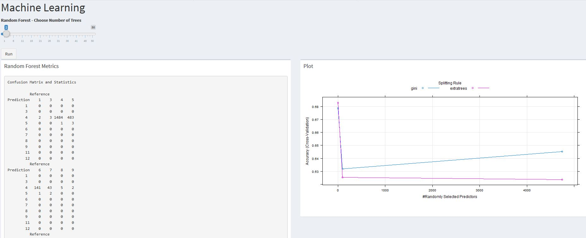
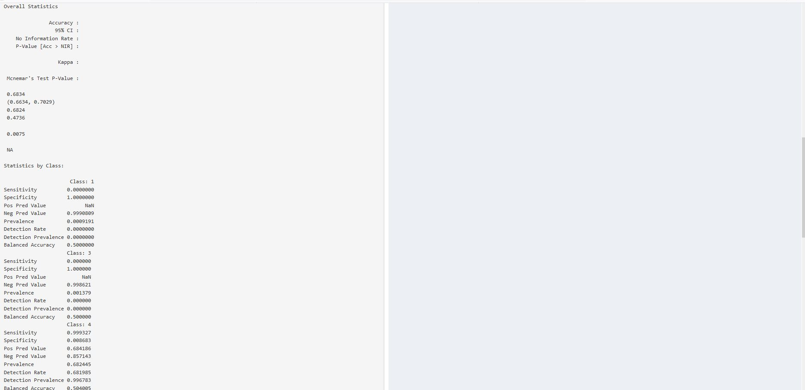

```{r knitr_init, echo=FALSE, cache=FALSE, warning=FALSE}
library(knitr)
library(rmdformats)

## Global options
options(max.print="75")
opts_chunk$set(echo=FALSE,
	             cache=TRUE,
               prompt=FALSE,
               tidy=TRUE,
               comment=NA,
               message=FALSE,
               warning=FALSE)
opts_knit$set(width=75)
```
 
# **DSBA-5122 Final Project**

## **Introduction: Domain Problem & Data Characterization**

### **Domain Problem**

We explored typical customer ticket classification data to grasp customer word usage and ticket results. Our domain problem is one for agents who handle service tickets to quickly and efficiently classify the problem and resolve the ticket. 

In a system without an automated classification system, agents would have to assign categories dependent on many variables, such as content and priority, and who to send tickets to. Many times, tickets can be classified incorrectly, which could be caused on accident, faulty information, or when the end user gives up trying to classify the ticket. Once this agent misclassifies the ticket, it is sent on to the next service desk, incorrectly, to fix and therefore wasting precious time for the next handler of the ticket. At a larger company, this happens multiple times a day. 

When an issue ticket is submitted, it must be processed and routed to the next employee to take action. Agents completing this task must read the actual submitted ticket to declare classification status. Many of these classification systems are complicated. Out of frustration, many agents decide to "pass the buck" and send the ticket to the next person to handle. By implementing machine learning, a company can refocus its customer service reps to other areas with minimal oversight in the classification of tickets. 

### **Data Characterization**

Tickets are generated by an end-user of a product or service. Customer service agents typically have to assign tags and/or categories to each ticket based on the nature of the problem and route the ticket to the appropriate party for resolution. 

For data about common words used in a customer ticket, we acquired a public use dataset, via GitHub, of typical words used in a ticket, and typical classifications of the ticket and creating text classification. 

### **Potential Users** 

The application is designed for service agents in any kind of field who handles the routing of submitted trouble tickets.

### **Application Information**

The application is hosted at https://github.com/ehelfrich/DSBA-5122-Group

## **Chapter 1: Operations and Data Type Abstraction**

### **Data Operations**

The dataset used for this application was a public use file available on GitHub. Functions were then created using operations which were called from the user interface and used tidy methods to filter, select, and mutate the dataset to provide information related to the options selected. 

### **Data Type Abstraction**

Our shiny application project is to have a multi-step display, with each step being interconnected to the previous step preparing high-dimensional data for the eventual use in machine learning. In the first step, the user can enter key words into a search field to generate a dataset. The next tab to explore would be the feature engineering tab, which the user would submit parameters, which will create a word cloud, word count, and the ability to choose a vectorization method between Term Frequency Inverse Document Frequency (TF-IDF) or using a count vectorizer. Once completed, the user clicks to dimensionality reduction in the next tab. Here, the user chooses the dimensionality method using either UMAP or TF-IDF. Then the user can adjust slider functions to create selections. The final step is to enter the data into a machine learning using a random forest matrix and the user will decide the quantity of trees to produce. 

## **Chapter 2: Visual Encoding & Interaction Design**

### **Visual Encoding**

Our data is designed to help a customer visualize text classification data. We encoded our initial data by providing summary statistics and a bar chart displaying the distribution of ticket classification categories. The user has the ability to remove stop words with the use of a toggle button and add custom stop words. 

+ 

Once the user has entered the search term, they can go to the feature engineering tab featuring a bar chart and word cloud. The values are encoded based on the selected variables using slider boards. The sliders will change how many words the application is looking at and it will adjust the ranges It will also give the user the ability to specify a minimum word count. Finally, the user will be able to determine which vectorization method they would like to use between TD-IDF or count vectorizer. 

+ 

The user can now move on to the next tab using dimensionality reduction, by using either UMAP or TSNE in the drop-down menu. Dimensionality reduction is used in cases of a high number of variables, which will reduce processing time and makes visualization of data easier. Choosing the UMAP function will show the data on an interactive graph of your selected dataset. 

+ 

The final step to automate classification of tickets is machine learning. Our application trains a model using a publicly available dataset but can be used on any kind of trouble ticket dataset. Our application uses a support vector machine model. Over time, accuracy increases with the volume of recommendations made. 

+ 
+ 

### **Interaction Design** 

The application takes advantage of machine learning to help classify tickets and eventually automate ticket routing. The machine learning aspect of our application will constantly be refined to provide better results. Our application provides the user the ability to visualize the text by selecting and setting different slider bars and toggle switches. 

## **Chapter 3: Algorithmic Design** 

### **Design**

The Shiny application and application logic are in separate files. By having them separated, finding functions to be called by the application is easier to find. Additionally, to speed up the application, we pick and choose which pieces of code to run in the server portion of the application. The suspended code and associated functions will run when the user of the application clicks on the options through the tabs. 

**Our data file is quiet large at (xxx) creating a possible impact in performance.....(what did we do to make this dataset run faster?)**

The use of reactive ensured when the user made selections to the application, the visualization changed to reflect the choices made by the user. In theory, this should improve the design efficiency. 

### **Performance** 

**I need help on this **

```
**example**

```

## **Chapter 4: Evaluation**

### **Who is the User?** 

The application is designed for a user who manages tickets in any kind of field who handles the routing of customer submitted tickets. The app is designed to analyze the free text in the ticket submission and for it to automatically suggest how to route the ticket. 

### **Using the Application**

The application is designed to reduce or eliminate the need for manual classification systems. When handling support tickets, the user must determine the category and urgency of the ticket. Agents can spend countless hours classifying and troubleshooting tickets, but many times, the agent will ultimately inappropriately assign the ticket to "other". With text classification using machine learning, we could have the application automatically classify and assign tickets, freeing up backend users for other tasks and duties. Additionally, it allows users to discover issues happening in real time on a massive scale.  

## **Chapter 5: Conclusions**

### **Future Work** 

When planning the design and scope of this application, we wanted to create an application that could serve a wide variety of audiences looking for efficient methods to handle support tickets. Future work could expand as we refine and develop this code. Machine learning and text classification will continue to experience innovative ideas to improve on for many years in the future. While assigning ticket classification may appear like a benign activity, the results of efficiencies gained would be astronomical. 

### **What's Next**

For the next iteration of this application, we would like to add python modules to enhance the machine learning aspect of our application. We also would like to discover a dataset with uncensored data to improve the accuracy and design of our own program. We intend to make our plots easier to see and use, which will allow users a greater use if interpretation for their results. As we further develop the application, we recognize it will become more difficult to load and install on other machines. We would like to integrate our application with Docker for the best production pipeline to the application. We can also improve our application by allowing the user to create custom stop words.  

## **Appendix**
**Exploratory work that didn’t' make it into the app. Highlight what we have tried (If Needed)**
