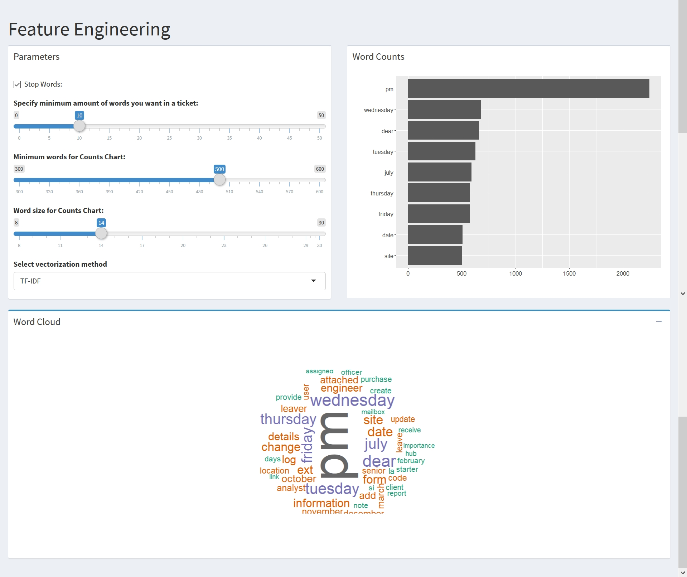

```{r knitr_init, echo=FALSE, cache=FALSE, warning=FALSE}
library(knitr)
library(rmdformats)

## Global options
options(max.print="75")
opts_chunk$set(echo=FALSE,
	             cache=TRUE,
               prompt=FALSE,
               tidy=TRUE,
               comment=NA,
               message=FALSE,
               warning=FALSE)
opts_knit$set(width=75)
```
 
# **DSBA-5122 Final Project**

## **Introduction: Domain Problem & Data Characterization**

### **Domain Problem**

We explored typical customer ticket classification data to grasp customer word usage and ticket results. Our domain problem is one for agents who handle service tickets to quickly and efficiently classify the problem and resolve the ticket. 

In a system without an automated classification system, agents would have to assign categories dependent on many variables, such as content and priority, and who to send tickets to. Many times, tickets can be classified incorrectly, which could be caused on accident, faulty information, or when the end user gives up trying to classify the ticket. Once this agent misclassifies the ticket, it is sent on to the next service desk, incorrectly, to fix and therefore wasting precious time for the next handler of the ticket. At a larger company, this happens multiple times a day. 

When an issue ticket is submitted, it must be processed and routed to the next employee to take action. Agents completing this task must read the actual submitted ticket to declare classification status. Many of these classification systems are complicated and time intensive. By implementing machine learning, a company can refocus its customer service reps to other areas with minimal oversight in the classification of tickets. 

This application was created to showcase the concept of a model, using a data science team approach, to demonstrate machine learning pipeline operations for a decision-making audience.  The result will allow decision makers to determine if the feature engineering steps and model results are a worth-while investment to “productionize” the pipeline.

### **Data Characterization**

Tickets are generated by an end-user of a product or service. Customer service agents typically have to assign tags and/or categories to each ticket based on the nature of the problem and route the ticket to the appropriate party for resolution. 

For data about common words used in a customer ticket, we acquired a public use dataset, via GitHub (https://github.com/karolzak/support-tickets-classification), of typical words used in a ticket, and typical classifications of the ticket and creating text classification. The data was pulled from a company's internal IT ticketing system and has already been stripped of all sensitive information.  

### **Potential Users** 

The application is designed to be a presentation tool to allow non-data scientists to view and understand feature engineering and model creation.

### **Application Information**

The application is hosted at https://github.com/ehelfrich/DSBA-5122-Group

## **Chapter 1: Operations and Data Type Abstraction**

### **Data Operations**

The dataset used for this application was a public use file available on GitHub. Functions were then created using operations which were called from the user interface and used tidy methods to filter, select, and mutate the dataset to provide information related to the options selected. 

The original data set included numerous different columns (severity, sub-categories, ticket type), but we only focused on tickets that had a ticket type of 1 and their categories.  The reason we filtered for ticket type is because in the real-world domain problem that this project is modeled after the company only wants to predict tickets of one ticket type.  The real-world data set has two major types of tickets (Tasks and Requests) and the company only wants to predict the “Request” ticket type.  We model this in the project’s data by have two Ticket Type Categories (1 and 2) and we filter our data to only look at Ticket Type Category of “1”.

### **Data Type Abstraction**

Our shiny application project is to have a multi-step display, with each step being interconnected to the previous step preparing high-dimensional data for the eventual use in machine learning. In the first step, the user can enter key words into a search field to generate a dataset. The next tab to explore would be the feature engineering tab, which the user would submit parameters, which will create a word cloud, word count, and the ability to choose a vectorization method between Term Frequency Inverse Document Frequency (TF-IDF) or using a count vectorizer. Once completed, the user clicks to dimensionality reduction in the next tab. Here, the user chooses the dimensionality method using either UMAP or TF-IDF. Then the user can adjust slider functions to create selections. The final step is to enter the data into a machine learning using a random forest matrix and the user will decide the quantity of trees to produce.

+ Data was filtered for only tickets with a ticket_type of 1
+ Only the body and category columns were selected from that filtered data set.  A unique row ID was added as another column
+ The data was then split into a test set at application start.  The test set was then removed from master set of data.
+ The master set of data was then used to generate a training set of data
+ Both the test and training sets used stratified sampling to keep the population distribution of the categories the same.

*Sample code of the data filtering*
```
# Filter ticket_type = 1 and drop unused columns
data = data %>%
  filter(ticket_type == 1) %>%
  select(body, category) %>%
  mutate(id = row_number())
  
# Split off Test Set
test_data = stratified(data, "category", .01)
train_data = data %>%
  anti_join(test_data, by = c("id" = "id"))

```

## **Chapter 2: Visual Encoding & Interaction Design**

### **Visual Encoding**

Our data is designed to help a customer visualize text classification data. We encoded our initial data by providing summary statistics and a bar chart displaying the distribution of ticket classification categories. The user has the ability to remove stop words with the use of a toggle button and add custom stop words to form a data training set. 

+ 

Once the user has a generated training set, they can go to the feature engineering tab featuring a bar chart and word cloud. The values are encoded based on the selected variables using slider boards. The sliders will change how many words the application is looking at and it will adjust the ranges It will also give the user the ability to specify a minimum word count. Finally, the user will be able to determine which vectorization method they would like to use between TD-IDF or count vectorizer. 

+ 

The user can now move on to the next tab using dimensionality reduction, by using either UMAP or TSNE in the drop-down menu. Dimensionality reduction is used in cases of a high number of dimensions and allows the number of dimensions to be reduced to 2 or 3.  These reduced dimensions can then be viewed in a 2-d/3-d plot that can be viewed by an audience.  This will help users visualize possible clusters of tickets in the data set and possibly see patterns between tickets. Choosing the UMAP/TSNE function will show the data on an interactive graph of your selected data set.  You can brush selected data points to see the distribution of the categories inside the selected region.

+ 

The final step to automate classification of tickets is machine learning. Our application trains a model using a publicly available dataset but can be used on any kind of trouble ticket dataset. Our application uses a support vector machine model. Over time, accuracy increases with the volume of recommendations made. 

+ 

### **Interaction Design** 

The application takes advantage of machine learning to help classify tickets and eventually automate ticket routing. The machine learning aspect of our application will constantly be refined to provide better results. Our application provides the user the ability to visualize the text by selecting and setting different slider bars and toggle switches. 

## **Chapter 3: Algorithmic Design** 

### **Design**

The core of the application is its ability to create a machine learning model to predict IT ticket categories based from the unstructured text data contained in the body of the ticket.  The application had to have the amount of data is uses limited in order to increase performance.  If this was to be used to create the ML model used, then all data would be used to create and test the model instead.  However, for the sake of the demonstration the amount of data is limited to about 15% of the total data.  The code is broken up into a UI and server file to improve readability.  The code also contains collapsible sections and comments for various functions to allow for easy readability.  Reactive functions were used to allow for caching of function results and increase app performance.

### **Performance** 

Data manipulations were done at the start of the app to prevent various dplyr operations to slow down users every time a function is called.

```
######################## Pre-App ####################################
# Load and reduce DataFrame 

data = read_csv('./data/all_tickets.csv') # correct path for runtime execution

# Filter ticket_type = 1 and drop unused columns
data = data %>%
  filter(ticket_type == 1) %>%
  select(body, category) %>%
  mutate(id = row_number())

```

The reactive functions allow various function results to be cached and used later by other functions.  This means if a reactive function is called later, the function will not have to run again.

```
# Returns tokens of unstructured text data
tokenizer = reactive({
  df = data_reduced()
  df_train = df[[1]]
  df_test = df[[2]]
  train_tokens = df_train %>%
    unnest_tokens(output = word, input = body)
  test_tokens = df_test %>%
    unnest_tokens(output = word, input = body)
  return(list(train_tokens, test_tokens))
})
```
Run buttons/isolate functions were used in the application to allow users to change parameters for various computationally complex operations without having them run after each input change.

```
ml_action = eventReactive(input$rf_run,{...})

isolate(...)

```

## **Chapter 4: Evaluation**

### **Who is the User?**

The user would be a senior position at a company for which you’re employed as a data scientist or a consultant. You need to present your work to these decision makers in order to inform them of how your model was created and what its performance is on their data.  The app is designed to visualize feature engineering and model design choices and understand why you made them by looking at the model metrics at the end of the report.  It is also flexible enough to allow the user to adjust the model inputs to see how the inputs interact with one another.

### **Using the application** 

Our shiny application project is to have a multi-step display, with each step being interconnected to the previous step preparing high-dimensional data for the eventual use in machine learning. In the first step, the user can decide to use stop words into a generated test set. The next tab is the feature engineering tab, which the user would submit sliding parameters, to create a word cloud, word count, and the ability to choose a vectorization method between Term Frequency Inverse Document Frequency (TF-IDF) or using a count vectorizer. Once completed, the user clicks to dimensionality reduction in the next tab. Here, the user chooses the dimensionality method using either UMAP or TF-IDF. Then the user can adjust slider functions to create selections. The final step is to enter the data into a machine learning using a random forest matrix and the user will decide the quantity of trees to produce.

## **Chapter 5: Conclusions**

### **Future Work** 

When planning the design and scope of this application, we wanted to create an application that could serve a wide variety of audiences looking for efficient methods to handle support tickets. Future work could expand as we refine and develop this code. Machine learning and text classification will continue to experience innovative ideas to improve on for many years in the future. While assigning ticket classification may appear like a benign activity, the results of efficiencies gained would be astronomical. 

### **What's Next**

For the next iteration of this application, we would like to add python modules to enhance the machine learning aspect of our application. We also would like to discover a dataset with uncensored data to improve the accuracy and design of our own program. We intend to make our plots easier to see and use, which will allow users a greater use if interpretation for their results. As we further develop the application, we recognize it will become more difficult to load and install on other machines. We would like to integrate our application with Docker for the best production pipeline to the application. We can also improve our application by allowing the user to create custom stop words.  

## **Appendix**
We attempted to implement a linear regression model using R, but we were unable to finish the development of the code.  Therefore, the linear model code was removed from the final application.
