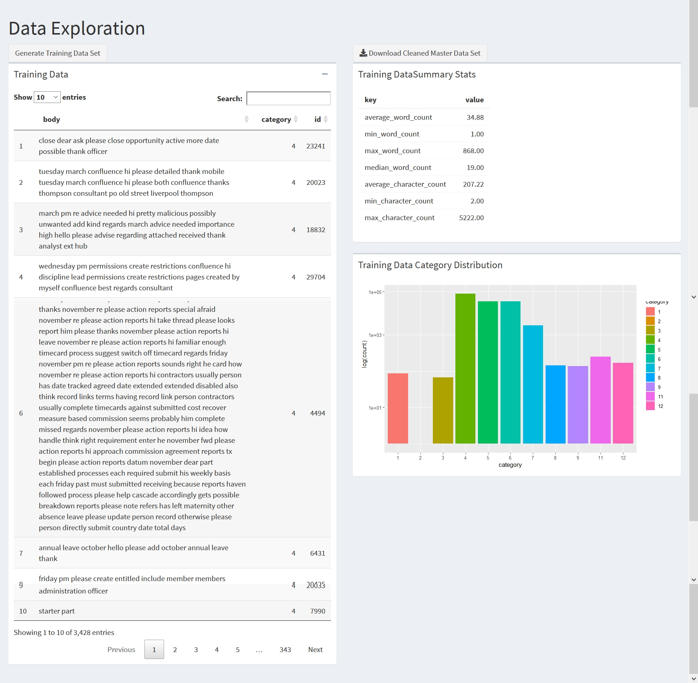
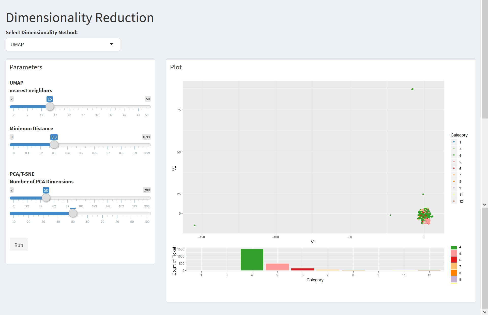

```{r knitr_init, echo=FALSE, cache=FALSE, warning=FALSE}
library(knitr)
library(rmdformats)

## Global options
options(max.print="75")
opts_chunk$set(echo=FALSE,
	             cache=TRUE,
               prompt=FALSE,
               tidy=TRUE,
               comment=NA,
               message=FALSE,
               warning=FALSE)
opts_knit$set(width=75)
```
 
# **DSBA-5122 Final Project**

## **Introduction: Domain Problem & Data Characterization**

### **Domain Problem**

We explored typical customer ticket classification data in an effort to grasp customer word usage and ticket results. Our domain problem is one for a back-end user/customer service agent to quickly and efficiently classify the problem and resolve the ticket. 

### **Data Characterization**

Tickets are generated by an enduser of a product or service. Customer service agents typically have to assign tags and/or categories to each ticket based on the nature of the problem, and route the ticket to the appropriate party for resolution. 

For data about common words used in a customer ticket, we acquired a public use dataset, via github, of typical words used in a ticket, and typical classifications of the ticket and creating text classification. 

### **Potential Users** 

The application is designed for customer service agent in any kind of field who handles the routing of customer submitted tickets.

### **Application Information**

The application is hosted at xxxxx_github

## **Chapter 1: Operations and Data Type Abstraction**

### **Data Operations**

The dataset used for this application was a public use file available on Github. Functions were then created using operations which were called from the user interface and used tidy methods to filter, select, and mutate the dataset to provide information related to the options selected. 

### **Data Type Abstraction**

Our shiny application project is to have a multi-step display, with each step being interconnected to the previous step. In the first step, the user has the ability to enter key words into a search field to generate a dataset. The next tab to explore would be the feature enginnering tab, which the user would submit parameters, which will create a word cloud, word count, and the ability to choose a vectoriation method between Term Frequency Inverse Document Frequency (TF-IDF) or using a count vectorizor. Once completed, the user moves on to dimensionality reduction in the next tab. Here, the user chooses the dimensionality method using either UMAP or TF-IDF. Then the user can adjust slider functions to create a _______. The final step is to enter the data into a machine learning using a random forrest matrix and the user will decide the quantity of trees to produce. 

## **Chapter 2: Visual Encoding & Interaction Design**

### **Visual Encoding**

Our data is designed to help a customer visualize text classification data. We encoded our initial data by providing summary statistics and a bar chart displaying the distribution of ticket classification categories. The user has the ability to remove stop words with the use of a toggle button, and add custom stop words. 

+ 

Once the user has entered the search term, they can go to the feature engineering tab featuring a bar chart and word cloud. The values are encoded based on the selected variables using sliderboards. The sliders will change how many words the aplication is looking at and it will adjust the ranges It will also give the user the ability to specift a minimum word count. Finally, the user will be able to determine wich vectorization method they would like to use between TD-IDF or count vectorizer. 

+ 

The user can now move on to the next tab using dimenstionality reduction using either UMAP or TSNE in the drop down menu. Choosin the UMAP function whill show the data on an interactive graph of your selected dataset. 

+ 

Talk about ML Solutions here. 

+ 

### **Interaction Design** 

The application takes advantage of machine learning to help classify tickets and evenutally automate ticket routing. The machine learning aspect of our application will constantly be refined to provide better results. Our application provdies the user the ability to visualize the text by selecting and setting different sliderbars and toggle switches. 

## **Chapter 3: Algorithmic Design** 

### **Design**

The Shiny application and application logic are in seperate files. By having them seperated, finding functions to be called by the application is easier to find. Additionally, to speed up the application, we pick and choose which pieces of code to run in the server portion of the application. The suspended code and associated functions will run when the user of the application clicks on the options through the tabs. 

Our data file is quie large at (xxx) creating a possible impact in performance.....(what did we do to make this dataset run faster)

The use of reactives ensured when the user made selections to the application, the visualiation changed to reflect the choices made by the user. In theory, this should improve the design efficiency. 

### **Performance** 

I need help on this 

```
example

```

## **Chapter 4: Evaluation**

### **Who is the User?** 

The application is designed for customer service agent in any kind of field who handles the routing of customer submitted tickets. The app is designed to analyize the free text in the ticket submission and for it to automatically suggest how to route the ticket. 

### **Using the Application**

The application is designed to reduce or elimiante the need for manual classification systems. When handling support tickets, the backend user must determine the catagory and urgency of the ticket. Back end agents can spend countless hours classifying and troubleshooting tickets, but many times, the agent will ultimately inappropriately assign the ticket to "other". With text classification using machine learning, we could have the application automatically classify and assign tickets, freeing up backend users for other tasks and duties.  

## **Chapter 5: Conclusions**

### **Future Work** 

### **What's Next**


## **Appendix**
Exploratory work nthat didnt' make it into the app. Highlight what we have tried. 